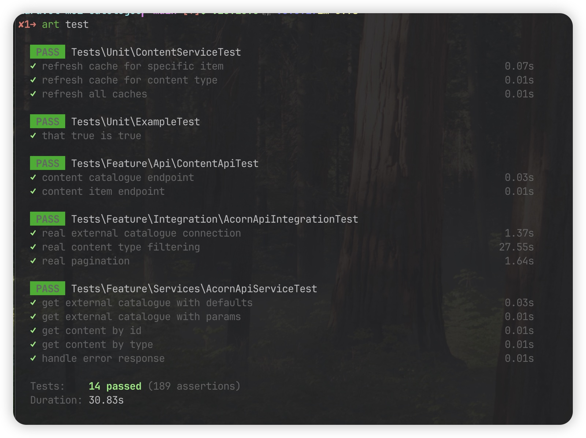
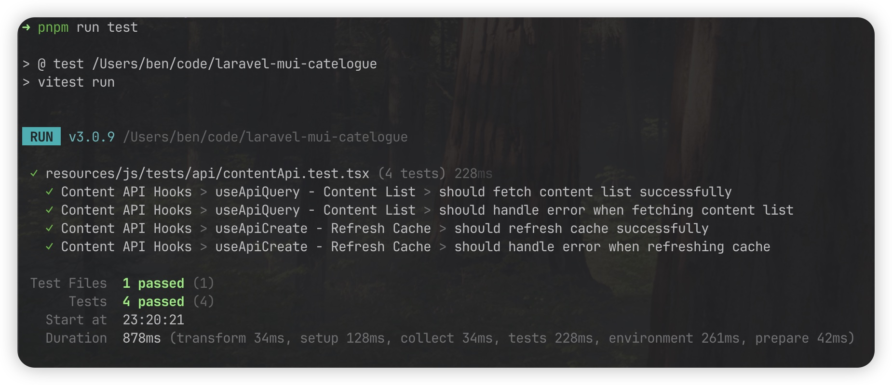
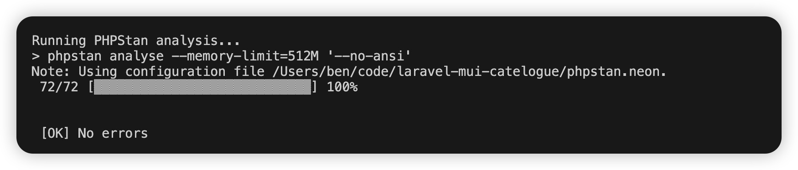
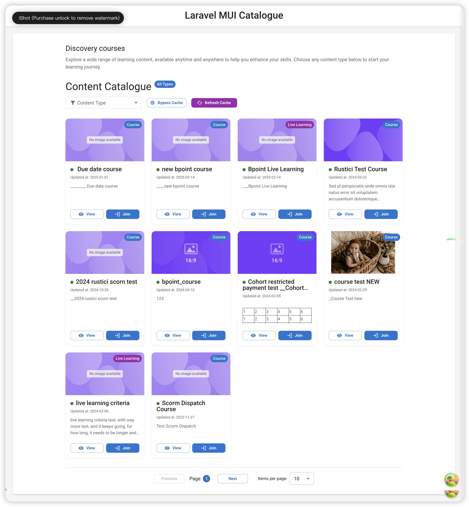

# Laravel MUI Content Catalogue 📚


A modern application built with Laravel and React.js that retrieves and displays learning content from the Acorn External Catalogue API.

## ✨ Awesome Features

- **Content Type Specialisation** 🏗️: Robust class hierarchy for different content types (Course, LiveLearning, Video, etc.) using both inheritance and composition
- **Fast Caching** ⚡: Multi-level caching strategy that significantly improves API response performance
- **Type-Safe Data Handling** 🛡️: Leverages Laravel Data v4 for reliable typing and validation
- **Resilient API Integration** 🔄: Includes retry mechanisms and comprehensive error handling that ensures reliability
- **Slick UI** 💎: Clean, responsive Material UI interface that makes learning content look professional
- **High Code Quality** 🧹: ESLint, Prettier, PHP CS Fixer and PHPStan keeping everything well-maintained
- **Comprehensive Automated Tests** ✅: Front and back-end testing covering all the critical components
- **Strict Commit Standards** 📝: Conventional Commits ensuring your Git history remains organized and consistent

## 🛠️ Main Tech Stack

- **Backend**: Laravel 12.x
- **Frontend**: React 19 + Material UI 7.0 + @tanstack/react-query
- **Data Layer**: Spatie Laravel Data
- **HTTP Client**: Guzzle with logging, caching and retry middleware
- **Testing**: PHPUnit and Pest for integration tests, Vitest for frontend
- **Code Linter**: PHPStan, ESLint, Prettier
- **Package Management**: PNPM 10.7
- **CI/CD**: GitHub Actions

## 📁 Project Structure

```
laravel-mui-catalogue/
├── app/                         # Core application code
│   ├── Data/                    # Data models (using Laravel Data)
│   │   ├── Content/             # Content class composition implementation (Alternative)
│   │   ├── Content.php          # Base content model (inheritance)
│   │   ├── CourseData.php       # Course data model
│   │   └── ...                  # Other content type models
│   ├── Enums/                   # Enumerations - Content type
│   ├── Http/                    # HTTP-related code (API controllers)
│   │   └── Controllers/         # API and Web controllers
│   ├── Jobs/                    # Queue jobs
│   ├── Services/                # Service layer
│   │   ├── Acorn/              # Acorn API service
│   │   ├── Content/            # Content service
│   │   └── HttpClient/         # HTTP client service (Guzzle)
│   └── Providers/              # Service providers
├── resources/                   # Frontend resources
│   ├── js/                      # React app code
│   └── css/                     # Stylesheets
├── tests/                       # Test code
│   ├── Feature/                 # Feature tests
│   │   ├── Api/                 # API tests
│   │   ├── Integration/         # Integration tests
│   │   └── Services/            # Service tests
│   └── Unit/                    # Unit tests
├── .github/                     # GitHub config
│   └── workflows/               # GitHub Actions workflows
│       ├── lint.yml             # Code quality checks
│       └── tests.yml            # Automated tests
├── config/                      # Configuration files
├── routes/                      # Route definitions
└── ...                          # Other project files
```

## 🧩 Content Type System

We've implemented the content type system in two different ways to cater to different architectural needs:

### 1. Inheritance Approach (Main Implementation)

```
app/Data/Content (Base class)
├── CourseData
├── LiveLearningData
├── VideoData
├── ResourceData
├── ProgramData
├── PageData
├── PartnerContentData
└── UnknownContentData (Fallback)
```

### 2. Composition Approach (Alternative)

```
app/Data/Content/Content (Base class)
├── Content/Course
├── Content/LiveLearning
├── Content/Video
├── Content/Resource
├── Content/Program
├── Content/Page
├── Content/PartnerContent
└── Content/UnknownContent
```

## 🔄 Caching Strategy

The system implements a clever caching strategy to optimise Acorn API access:

### Key Features

1. **Content Type-Specific Caching**: Different content types get custom cache durations
2. **Cache Version Control**: Version changes automatically refresh all caches
3. **Background Refresh**: When cache gets close to expiry, it refreshes in the background while still serving current cached data
4. **Cache Bypass**: API supports `noCache=true` parameter for direct data retrieval
5. **Manual Refresh**: API endpoints for manually refreshing specific content caches

## 🚀 Installation & Setup

### Requirements

- **PHP 8.3+**
- **Node.js 22+**
- **PNPM 10.7+**
- **SQLite** (development environment)

### Getting Started

```bash
# Clone the repo
git clone https://github.com/yourusername/laravel-mui-catalogue.git
cd laravel-mui-catalogue

# Install PHP dependencies
composer install

# Install JavaScript dependencies
pnpm install

# Set up environment
cp .env.example .env
php artisan key:generate

# Configure Acorn API credentials in .env
# ACORN_API_BASE_URL=https://staging.acornlms.com
# ACORN_API_TENANCY_ID=3
# ACORN_API_TOKEN=...

# Run migrations (if applicable)
php artisan migrate

```

### Running the App

```bash
# Start Laravel dev server
php artisan serve

# Start laravel queue worker
php artisan queue:work

# In another terminal, start frontend dev server
pnpm run dev
```

Head to http://localhost:8000 to check it out.

### Development Commands

```bash
# Start dev server with hot reload
pnpm run dev

# Build frontend assets
pnpm run build

# Run PHP tests
pnpm run test:backend
# or
php artisan test

# Run frontend tests
pnpm run test

# Check code quality
pnpm run lint
pnpm run phpstan

# Format code
pnpm run format
```

## 📝 API Endpoints

### Get Content List

```
GET /api/v1/content?page=1&perPage=10&contentType=course&noCache=false
```

Parameters:

- `page` (optional): Page number (integer, min 1)
- `perPage` (optional): Items per page (integer, min 1, max 100)
- `contentType` (optional): Filter by content type (options: course, live learning, resource, video, program, page, partner content)
- `noCache` (optional): Bypass cache (boolean: true/false)

### Get Specific Content Item

```
GET /api/v1/content/{id}?noCache=false
```

Parameters:

- `id`: Content ID
- `noCache`: Bypass cache (default false)

### Refresh Cache

```
POST /api/v1/content/refresh-cache?id=123
```

or

```
POST /api/v1/content/refresh-cache?contentType=course
```

Parameters (at least one required):

- `id`: Refresh cache for specific content item
- `contentType`: Refresh cache for all content of specific type

## ✅ Test Results

Here are the test results:

### Backend Tests



### Frontend Tests



### PHPStan Analysis



## 📊 Code Quality

We're serious about code quality:

- **PHPStan** static analysis for reliable type safety
- **ESLint** and **Prettier** keeping JavaScript/TypeScript code consistent
- **Husky** pre-commit hooks preventing problematic code from being committed
- **GitHub Actions** automatically running tests and quality checks

## 🔒 Automated Quality Checks

We've implemented automated quality checks to maintain high code standards:

### Pre-Commit Hooks

Using Husky, we run lint-staged to ensure code quality before each commit:

- Formatting checks with Prettier
- Linting with ESLint
- Type checking with TypeScript

### Pre-Push Hooks

Before code is pushed to the repository, these checks run automatically:

- Frontend lint checks
- Frontend unit tests (Vitest)
- Backend unit tests (PHPUnit/Pest)
- PHPStan static analysis

### GitHub Actions Workflows

#### Code Quality (lint.yml)

Ensures code quality on every push and pull request:

- PHP code style enforcement with Laravel Pint
- Frontend code formatting with Prettier
- ESLint for JavaScript/TypeScript
- Type checking for frontend code
- Security audit for both PHP and JavaScript dependencies

#### Automated Tests (tests.yml)

Verifies application functionality on every push and pull request:

- Runs on PHP 8.4 and Node.js 22
- Builds frontend assets
- Sets up testing environment
- Runs backend tests excluding external API calls
- Configures mock API endpoints for isolated testing

These automated checks help us maintain code quality and prevent regressions, ensuring the codebase stays clean and maintainable.

## 🖼️ Application UI

Below is a screenshot of the application user interface showing the content catalogue:


